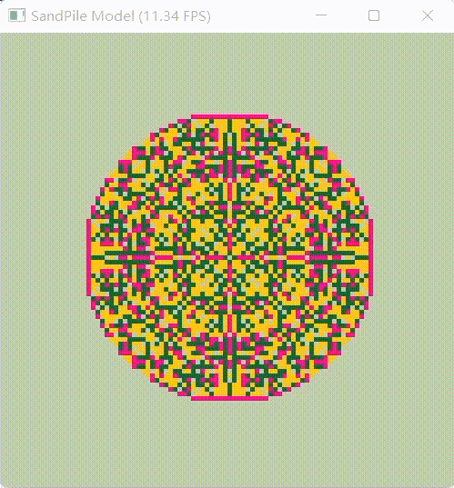

# 太极图形课S1-沙堆模型
## 背景简介
对沙堆中心不断投入新的沙粒，每当一个格子的沙粒积攒到4，就会分散到周围四个格子上

## 成功效果展示

## 整体结构（Optional）
源代码（49）

```python
import taichi as ti
ti.init(arch=ti.gpu)

res = 500
scale = 5

pixels = ti.Vector.field(3, ti.uint8, shape = [res, res])
sandpile = ti.field(ti.i32, shape = [int(res/scale), int(res/scale)])
iters = 5

@ti.kernel
def throw_sand():
    sandpile[int(res/scale)/2+0.5, int(res/scale)/2+0.5] += 1

@ti.kernel
def render():
    color = 0xE7E0AA
    for i, j in pixels:
        if sandpile[i/5, j/5] == 0:
            pixels[i, j] = [171, 182, 155]
        elif sandpile[i/5, j/5] == 1:
            pixels[i, j] = [234, 0, 118]
        elif sandpile[i/5, j/5] == 2:
            pixels[i, j] = [230, 178, 0]
        elif sandpile[i/5, j/5] == 3:
            pixels[i, j] = [0, 81, 28]

@ti.kernel
def evolve():
    for i, j in sandpile:
        if sandpile[i, j] >= 4:
            sandpile[i + 1, j] += sandpile[i, j] / 4
            sandpile[i - 1, j] += sandpile[i, j] / 4
            sandpile[i, j - 1] += sandpile[i, j] / 4
            sandpile[i, j + 1] += sandpile[i, j] / 4
            sandpile[i, j] = 0

def main():
    gui = ti.GUI("SandPile Model", res)
    while gui.running:
        for j in range(iters):
            throw_sand()
            evolve()
        render()
        gui.set_image(pixels)
        gui.show()

if __name__ == '__main__':
    main()
```

## 运行方式
`python3 main.py`

## 存在问题

随时间增加，会逐渐失去对称性


感谢 **[Jack12xl](https://github.com/Jack12xl)**的帮助，现在这个问题得以解决



## 代码链接

[Code](https://github.com/darkwuta/2021_taichi_course_homework)

